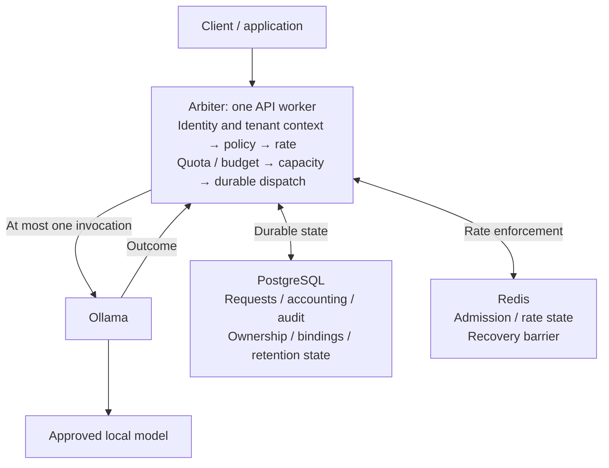

# Arbiter

Arbiter is a **governance/control plane for local AI execution**.

Applications should not be able to invoke shared models without governance.
Arbiter checks authenticated tenant identity, policy, rate, quota, budget, and
capacity before durable dispatch authorization. Only then can Ollama execute
an approved model. PostgreSQL owns durable state; Redis governs short-term rates.
Arbiter does not persist prompts or completions.

**Current release: [v0.1.0](https://github.com/bluxo1/Arbiter/releases/tag/v0.1.0).**
The final release gate and independent evidence review passed at
[`59e6f299`](https://github.com/bluxo1/Arbiter/commit/59e6f299e590a79bb0d9dd1bad25053822acc762):
**1,308 full-regression tests passed**, with **zero failures, errors, skips, or
deselections**. Proofs exercised real PostgreSQL, Redis, pinned Ollama, migrations,
backup/restore, fault recovery, security, observability, and bounded load/saturation.
The signed release tag stays on that verified commit; later documentation changes
do not change the release artifact.

[Quick start](#quick-start) · [Architecture](#architecture)
· [Guarantees](#scope-and-guarantees) · [API](#api-access)
· [Operator commands](#operator-commands) · [Recovery](#recovery-and-diagnostics)
· [Known limitations](#known-limitations) · [Documentation](#documentation)

## Scope and guarantees

- Tenant authority comes from a verified API key or an OIDC identity with active
  database membership. Caller-supplied tenant or role claims do not grant access.
- Application scoping, PostgreSQL FORCE RLS, and composite tenant/object foreign
  keys protect tenant-owned records. Missing tenant context denies access.
- Admission checks identity, scopes, approved model, rate, quota, budget, and
  capacity before committed dispatch authorization. Unavailable enforcement
  state fails closed.
- Each dispatched request consumes one daily quota unit and the model's fixed
  integer credit charge. Credits are allocation units, not payments or token
  billing. Proven undispatched reservations can be released; dispatched failures
  and unknown outcomes remain charged.
- Idempotency prevents duplicate allocation and dispatch. Matching retries return
  prior-admission metadata; they never replay assistant output.
- Each dispatched request permits at most one provider invocation. There is no
  automatic provider retry, provider/model fallback, or model pull.
- Unknown outcomes retain charged accounting and quarantined capacity. Restart
  reconstructs durable ownership; elapsed time alone cannot free uncertain work.
- The API runtime is read-only, uses restricted database credentials, and keeps
  tenant audit/accounting evidence separate from conversation content.
- The supported deployment is one API worker on one Docker Compose host.
  Streaming, caller-selected provider URLs, tool execution, cloud providers,
  payments, and horizontal scaling are outside v0.1 scope.

See [product scope](docs/PRD.md), [architecture](docs/Architecture.md), and
[implementation contracts](docs/Design.md) for the owning specifications.

## Architecture

The governed execution path is:

```text
request -> identity / tenant -> policy / model -> Redis rate gate
        -> durable quota / budget reservation -> capacity ownership
        -> durable dispatch authorization -> provider -> accounting / audit
```



Accounting and audit evidence commit at reservation, dispatch, and outcome
transitions. Redis is never authority for budgets, dispatch, or capacity ownership.
The existing OIDC issuer and local operator CLI supply identity and administration;
they are separate trust boundaries. See the [system architecture](docs/Architecture.md)
and [admission sequence](docs/Design.md#admission-and-dispatch) for the full model.

## Quick start

The documented host is Windows with PowerShell and Docker Desktop's Linux engine
through WSL2. Run commands from the repository root. Application images use
Python 3.13 and hash-pinned dependencies; container versions and digests live in
[Dockerfile](Dockerfile) and [compose.yaml](compose.yaml).

Before startup, provide:

- The existing OIDC issuer, identity network, and trusted CA referenced by
  [.env.example](.env.example). Arbiter does not provision Keycloak or its users.
  The public issuer and private container JWKS URL are distinct configuration
  values; preserve the issuer's exact identity.
- Protected storage under `D:\AI & ML\ArbiterData`, including secret files.
- GPU-enabled Compose and an already installed, operator-approved Ollama model
  when testing real inference. Startup and requests never download models.

For a new checkout, copy the public configuration template and review its paths
and OIDC settings before continuing. Keep an existing `.env` when updating:

```powershell
Copy-Item .env.example .env
```

Prepare secrets, build the application, and initialize the database explicitly:

```powershell
.\scripts\prepare-local.ps1
$env:ARBITER_SECRETS_DIR = 'D:/AI & ML/ArbiterData/secrets'
$env:ARBITER_DATA_LINUX_ROOT = '/run/desktop/mnt/host/d/AI & ML/ArbiterData'

docker compose config --quiet
docker compose build api
docker compose up -d --wait postgres redis
docker compose --profile operations run --rm bootstrap
docker compose --profile operations run --rm migrate
docker compose up -d --wait api ollama
```

Secret preparation preserves existing values. Bootstrap provisions database roles
using its separate privileged credential; migrations use the migration credential.
Neither runs during API startup. The API receives only its runtime and maintenance
credentials plus the cursor key, API-key pepper, and request-fingerprint key.
Keep secret values outside Git and protect the host directories: local Compose
secrets are file mounts.

Retain the pepper, cursor key, and fingerprint key/version separately from database
backups. Pepper rotation requires reissuing affected API keys. Cursor-key rotation
invalidates outstanding cursors. Fingerprint key rotation/key-ring support is not
implemented; retain the key/version while live requests or retained idempotency
tombstones require it.

Only the API is published, at `127.0.0.1:8000` by default. PostgreSQL, Redis, and
Ollama use private networks and persistent volumes backed by the configured D:
directories. Ollama health establishes metadata availability, not model approval
or inference readiness. External API exposure requires operator-managed TLS
ingress and a reviewed trusted-proxy configuration.

For a normal stop, drain supervised work and follow the
[startup and shutdown runbook](docs/Recovery.md#startup-and-normal-stop).
`docker compose down` retains persistent data; never use `down --volumes` as
routine shutdown or recovery.

## API access

Management endpoints use OIDC Bearer JWTs and active database membership.
Workload endpoints use Bearer API keys bound to one tenant, without a tenant
selector. Key secrets are returned once at creation and cannot be retrieved.

| Method and route | Access and purpose |
| --- | --- |
| `GET /health/live` | Minimal liveness; HTTP 200. |
| `GET /health/ready` | Conservative readiness; currently HTTP 503. |
| `GET /v1/models` | Valid API key; tenant-approved model catalog. |
| `POST /v1/chat/completions` | API key with `inference:write`; governed non-streaming chat. |
| `GET /v1/usage` | API key with `usage:read`; current UTC daily/monthly totals. |
| `GET /v1/requests/{request_id}` | API key with `usage:read`; tenant-scoped request metadata. |
| `GET /v1/tenants/{tenant_id}/models` | OIDC member/admin; approved model catalog. |
| `GET /v1/tenants/{tenant_id}/usage` | OIDC member/admin; current or bounded historical usage. |
| `GET /v1/tenants/{tenant_id}/requests/{request_id}` | OIDC member/admin; request metadata. |
| `GET /v1/tenants/{tenant_id}/audit` | OIDC member/admin; content-free audit events. |
| `POST /v1/tenants/{tenant_id}/keys` | OIDC admin; create a scoped key. |
| `GET /v1/tenants/{tenant_id}/keys` | OIDC admin; list key metadata without secrets. |
| `POST /v1/tenants/{tenant_id}/keys/{key_id}/revoke` | OIDC admin; idempotent revocation. |

For chat, send `Authorization: Bearer <API key>`, `Content-Type: application/json`,
and a required `Idempotency-Key` with a body such as:

```json
{
  "model": "approved_alias",
  "messages": [{"role": "user", "content": "Hello"}],
  "max_output_tokens": 256
}
```

Replace `approved_alias` with an active, registered alias approved in the tenant's
policy and bound to a verified native model. An empty registry or policy produces
an empty catalog. Catalog reads never invoke or download a model.

Chat accepts 1–32 messages with `system`, `user`, or `assistant` roles, at most
32 KiB of combined UTF-8 content, and a 64 KiB body. Output defaults to 256 tokens,
with a maximum of 1,024 and the selected model's lower cap. Unknown fields and
unsupported options are rejected. The response contains the generated request
ID, public alias, assistant message, available token counts, and charged credits;
this is a bounded interface, not full OpenAI API compatibility.

Audit, key, and model lists use opaque tenant-bound cursors with a default page
size of 50 and a maximum of 100. Pagination does not promise a frozen snapshot;
cursors do not require their anchor row to remain present. Usage/request routes
expose accounting and state without completion replay. See the
[HTTP contracts](docs/Design.md#http-interface) for schemas, historical selectors,
scope rules, and sanitized error codes.

## Operator commands

Operator administration uses a separate local database credential through the
Compose operations profile. Start PostgreSQL and apply bootstrap/migrations first;
these commands do not require API, Redis, or Ollama. There is no HTTP superuser
or tenant-admin route for changing allocation policy or the global model registry.

### Create a tenant and membership

```powershell
docker compose --profile operations run --rm operator create-tenant

docker compose --profile operations run --rm operator create-member `
  --tenant '<tenant UUID returned above>' `
  --issuer 'https://localhost:18443/realms/arbiter' `
  --subject '<existing issuer subject>' --role admin
```

Use the configured issuer and an existing subject from a trusted operator process.
Membership creation records the exact issuer/subject binding; it does not create
an OIDC account. Roles are `member` and `admin`. Every `create-tenant` invocation
creates a distinct UUID tenant, so do not automatically retry it after a lost
response.

Suspend or reactivate a tenant with `set-tenant-status`:

```powershell
docker compose --profile operations run --rm operator set-tenant-status `
  --tenant '<tenant UUID>' --status suspended
```

Status values are `active` and `suspended`. Mutations and their content-free audit
evidence commit together; audit failure rolls back the operation. Operator audit
identifies the shared database role `arbiter_operator`, not an individual human.

### Register and bind an approved model

Before registration, verify the exact text-model digest, pinned runtime,
context/output behavior, and license. Retain the evidence privately and place its
attestation under `ARBITER_MODEL_APPROVALS_DIR`, mounted read-only into the operator
container at `/run/approvals`. Preparation creates an empty protected directory;
it does not approve a model.

The strict approval JSON contains `adapter` (`ollama`), `model_digest`,
`runtime_digest`, `verification_digest`, `context_cap`, `output_cap`,
`verified_text`, and `license_accepted`. Digests use `sha256:` followed by 64
lowercase hexadecimal characters; `verification_digest` identifies the retained
verification evidence. Both flags attest to completed approval. The CLI checks
structure and bounds; it does not benchmark a provider or accept a license.

```powershell
docker compose --profile operations run --rm operator register-model `
  --alias '<public alias>' --adapter ollama --digest '<approved sha256 digest>' `
  --context-cap 4096 --output-cap 1024 --credit-charge 10 --state inactive `
  --approval /run/approvals/verified-model.json

docker compose --profile operations run --rm operator update-model `
  --alias '<same public alias>' --adapter ollama --digest '<approved sha256 digest>' `
  --context-cap 4096 --output-cap 1024 --credit-charge 10 --state active `
  --expected-revision 1 --approval /run/approvals/verified-model.json

docker compose --profile operations run --rm operator bind-native-model `
  --model-id '<UUID returned by register-model>' --expected-revision 2 `
  --provider-kind ollama --native-name '<operator-approved local tag>' `
  --approval /run/approvals/verified-model.json
```

These revision values illustrate a newly registered model. Updates and binding
advance the model revision atomically and append immutable global journal
evidence. After a later update, bind the verified native tag for the new revision
before execution. The public alias is never the native provider tag. Registration
does not add the alias to a tenant's approved policy.

### Set the complete tenant policy

After registering and activating an approved model, set all five allocation
limits and the complete alias list:

```powershell
docker compose --profile operations run --rm operator set-tenant-policy `
  --tenant '<tenant UUID>' --tenant-rate 60 --key-rate 30 --daily-quota 1000 `
  --monthly-budget 10000 --concurrency 1 --model-alias '<approved public alias>'
```

Repeat `--model-alias` for additional approved models; omitting it approves none.
Each call replaces the complete policy and appends a new revision with audit
evidence. Rate limits are per 60 seconds; quota windows are UTC days and budget
windows are UTC months. Limits are checked nonnegative integers; zero denies new
admission. Tenant concurrency is bounded to 0–2 under the current deployment
capacity contract. Raising that ceiling requires a reviewed capacity change.

## Retention

Retention is explicit, bounded operator maintenance. Runtime roles have no generic
DELETE privileges; migration-role direct deletion of protected audit/history rows
is blocked by retention guards (`42501: retention deletion only`). Supported cleanup
uses scoped retention functions through the operator credential and records fresh
audit evidence in the same transaction. There is no runtime deletion endpoint or
automatic purger.

```powershell
docker compose --profile operations run --rm operator retire-requests `
  --tenant '<tenant UUID>' --key '<key UUID>' --limit 100

docker compose --profile operations run --rm operator retire-history `
  --tenant '<tenant UUID>' --limit 100
```

| Record | Earliest cleanup eligibility |
| --- | --- |
| Definite terminal request graph | 90 days after `finished_at`; only `succeeded`, `failed`, `released`, or `rejected_capacity`. |
| Idempotency tombstone | 90 days after its API key's revocation; expiration alone is insufficient. |
| Quota/budget window | 13 UTC calendar months after closing, with no retained references. |
| Standalone audit event | 90 days after `occurred_at`, with no retained references. |

`retire-requests` retires up to the requested limit of eligible requests and
expires up to that limit of eligible tombstones for one tenant/key. Before deleting
a request graph, it preserves a minimal idempotency tombstone atomically. Matching
retries still return 409 `request_already_admitted`; different fingerprints return
409 `idempotency_conflict`. Retired status URLs return 410 `request_retired` with
only the request ID and final state. Active or expired-but-unrevoked keys retain
their tombstones indefinitely.

`retire-history` independently removes up to the requested limit of eligible quota
windows, budget windows, and standalone audits for one tenant. Both commands accept
limits from 1 to 100. Run request retirement first when its retained graph protects
older windows. Cleanup preserves aggregate totals and global model/binding
history; it never resets or recomputes counters. API keys are not purged.

Unresolved requests, including `unknown` work after capacity clearance, remain
retained. Age alone does not make referenced history eligible. Every successful
cleanup batch, including one that removes no rows, creates new content-free audit
evidence with its own 90-day retention period. See
[request retention](docs/Design.md#retained-request-cleanup-and-idempotency-tombstones)
and [history retention](docs/Design.md#aggregate-windows-and-standalone-audit-retention)
for the exact predicates and privilege boundaries.

## Recovery and diagnostics

The API runs a 10-second maintenance pass that releases abandoned, undispatched
reservations older than 30 seconds. Startup marks prior nonterminal dispatched
work `unknown` and reconstructs quarantined capacity. Redis restart or state loss
requires a full 60-second recovery barrier; a successful PING does not waive it.

Unknown work is never automatically retried or refunded. Operator clearance
requires independent confirmation that provider work has stopped and that an old
API worker cannot issue another authorized invocation. The clearance assertion
does not inspect or cancel Ollama. Follow the
[unknown-capacity procedure](docs/Recovery.md#operator-unknown-capacity-clearance)
and the [backup/restore runbook](docs/Recovery.md) for incident handling.

Foundation diagnostics can run without a healthy dependency prerequisite:

```powershell
docker compose --profile operations run --rm --no-deps diagnostics
```

Exit 0 means bounded PostgreSQL runtime-role/schema and Redis configuration checks
passed; exit 1 means a check failed. Output contains fixed check names and
booleans, not tenant records. Foundation checks do not certify application
readiness or replace migration/isolation tests. Private local metrics, safe
logging, and dependency/secret scans are described in
[observability and security](docs/Observability.md); there is no public metrics route.

## Known limitations

- v0.1.0 supports one host and one API worker. External exposure requires
  operator-managed TLS ingress; the documented setup uses Windows, PowerShell,
  and Docker Desktop's Linux engine.
- Backup/restore proof uses a fresh database in the same PostgreSQL cluster;
  fresh-host disaster recovery has not been proven.
- Clearing unknown capacity requires operator attestation that provider work has
  stopped and the old API worker cannot dispatch again. The command does not
  inspect or cancel provider work.
- Metrics reset on process restart; last observations can be stale or unobserved.
- Secret detection is bounded. OSV advisory checks cover Python dependencies,
  without certifying OS/container vulnerability coverage.
- `/health/live` returns 200; public `/health/ready` deliberately remains 503
  under the conservative contract. Inspect private recovery diagnostics.
- Load proof contains three host-specific samples and a controlled saturation
  check. It establishes no general throughput, latency SLA, or benchmark ranking.

Read the [recovery](docs/Recovery.md) and [observability/security](docs/Observability.md)
runbooks before operating the stack. The [v0.2 roadmap](docs/Roadmap.md) is a
proposal; it does not extend the v0.1.0 guarantees.

## Development and focused verification

Read [the agent workflow](docs/Agents.md), [engineering rules](docs/Rules.md),
and [project memory](docs/Memory.md) before making changes. Use the verification
image for the pinned Python/toolchain environment. Its default command runs
pytest; specify a command or test target explicitly for bounded checks.

```powershell
docker build --target verification -t arbiter-local:verification .

docker run --rm --network none --read-only --tmpfs /tmp `
  arbiter-local:verification ruff check --no-cache .
docker run --rm --network none --read-only --tmpfs /tmp `
  arbiter-local:verification ruff format --check --no-cache .
docker run --rm --network none --read-only --tmpfs /tmp `
  arbiter-local:verification mypy --strict --cache-dir=/tmp/mypy
docker run --rm --network none --read-only --tmpfs /tmp `
  arbiter-local:verification python -m pip check
```

These checks inspect the files copied when the image was built. Rebuild after
source changes, or use the canonical harness's read-only source mount.

| Environment gate | Required integration setup |
| --- | --- |
| `ARBITER_TEST_DATABASE=1` | Real migrated PostgreSQL, reachable network, and explicitly mounted test credentials. |
| `ARBITER_TEST_MIGRATIONS=1` | Bootstrap/migration credentials; fresh randomly named disposable databases. |
| `ARBITER_TEST_REDIS=1` | Real Redis with the required persistence/configuration. |
| `ARBITER_TEST_EXIT_HOST=1` | Coordinated host fault/restart controller and disposable infrastructure. |

Mount test credentials read-only into verification containers; privileged test
credentials do not belong in the API. Migration tests never downgrade the
application database. Keep fault controllers exclusive and use explicit test
paths for focused work. [The Phase 3 harness](scripts/verify-phase3.ps1) defines
the existing verification network, mounts, gates, and bounded groups. A run with
integration gates disabled is not real-database or release evidence.

Dependency locks target Python 3.13 on Linux amd64 and install with
`--require-hashes`. Regenerate them with
[the lock helper](scripts/lock_dependencies.py) in the pinned base image, then
review and scan the result. The runtime image contains only runtime dependencies;
the verification target adds test, lint, and type tools.

## Host release verification

Run the coordinator from **normal host Windows PowerShell** with Docker Desktop
Linux-engine access, from the repository root:

```powershell
powershell.exe -NoProfile -ExecutionPolicy Bypass -File .\scripts\verify-release.ps1
```

The default requires clean `main`, an empty index, and `main == origin/main`.
It uses the existing disposable `arbiter-p34` PostgreSQL/Redis stack and protected
secrets, the configured identity network/CA, GPU-enabled Compose, and the
**already installed** model pinned by
[the real Ollama proof](tests/phase4_exit_real_ollama.py). No model is pulled or
substituted. The default model cache is `D:\AI & ML\ArbiterData\ollama\models`.

Do not run another fault/recovery controller concurrently. A shared release lock
and active container/process checks reject detected overlap; they cannot fence
arbitrary Docker commands issued outside the coordinator.

The coordinator runs these stages in order:

1. Build current images and run lint, format, strict typing, dependency, syntax,
   Compose, and security checks, including OSV and pinned Trivy positive controls.
2. Start an isolated release Compose project with fresh unique PostgreSQL/Redis
   storage; check migrations, healthy services, foundation diagnostics, and the
   private metrics socket. Public readiness remains 503 under its existing contract.
3. Run the canonical full suite once with real database, migration, Redis, and
   host-fault gates. The default permits no deselection and requires zero failures,
   errors, or skips.
4. Run real pinned Ollama, same-cluster template0 backup/restore, Redis/process/
   operator recovery, restart-barrier, and observability proofs. Validate JUnit
   counts and required groups, then scan textual evidence.

A child failure stops the gate; suites are not automatically retried. A bounded
test-only observer records model/runtime/hardware identity, three real-request
latency samples, and controlled capacity-2 saturation. These are host-specific
observations, not general throughput or statistically reliable p95 claims.

Evidence stays outside Git under the Phase 3 data root's `tmp\release-*`, protected
by a private Windows ACL. `summary.json`, stage logs, and JUnit counts record
outcomes and timings. Fresh application storage is under
`D:\AI & ML\ArbiterData\phase5\release-*\ArbiterData`. Existing volumes/model
assets and failure evidence are preserved. Services remain for inspection; the
coordinator does not commit, tag, delete volumes, or declare v0.1 complete.

For review of uncommitted release tooling/docs only, the coordinator also accepts
`-AllowReleaseToolingChanges`. It permits only unstaged `README.md`,
`docs/Memory.md`, `scripts/verify-release.ps1`, and `tests/test_verify_release.ps1`,
and records/checks tooling hashes. It does not permit runtime, migration, or
Python-test changes. The process-local execution-policy flag changes no machine
policy. The historical `-DeselectKnownUsageFixture` exception is limited to its
single committed allowlist entry; it is not part of the default gate.

Non-Docker coordinator controls have a separate entry point:

```powershell
powershell.exe -NoProfile -ExecutionPolicy Bypass -File .\tests\test_verify_release.ps1
```

Review release evidence against [delivery milestones](docs/Phases.md),
[recovery limitations](docs/Recovery.md), and
[observability constraints](docs/Observability.md) before declaring completion.

## Documentation

| Document | Owns |
| --- | --- |
| [PRD](docs/PRD.md) | Product scope, actors, allocation semantics, acceptance criteria. |
| [Architecture](docs/Architecture.md) | Components, deployment topology, trust boundaries. |
| [Design](docs/Design.md) | HTTP contracts, schema, admission, retention, failure behavior. |
| [Rules](docs/Rules.md) | Mandatory tenant invariants and engineering constraints. |
| [Phases](docs/Phases.md) | Delivery order and release evidence gates. |
| [Recovery](docs/Recovery.md) | Startup, shutdown, backup/restore, incident procedures. |
| [Observability](docs/Observability.md) | Restricted metrics/logging and repeatable security checks. |
| [v0.2 roadmap](docs/Roadmap.md) | Proposed priorities and evidence needed for the next release. |
| [Project copy](docs/Portfolio.md) | Factual portfolio, resume, and recruiter descriptions. |
| [Agents](docs/Agents.md) | Contributor and coding-agent workflow. |
| [Memory](docs/Memory.md) | Dated implementation/validation history and handoffs. |
| [Prompt](docs/Prompt.md) | Reusable task brief. |
